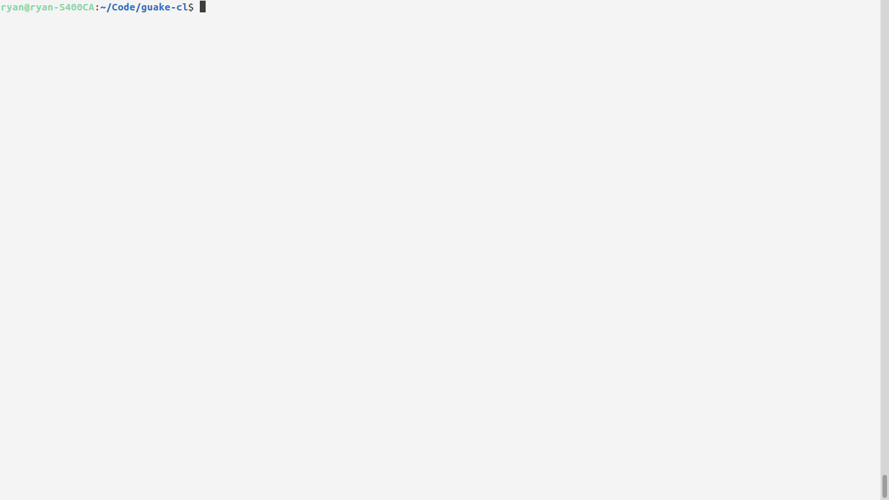
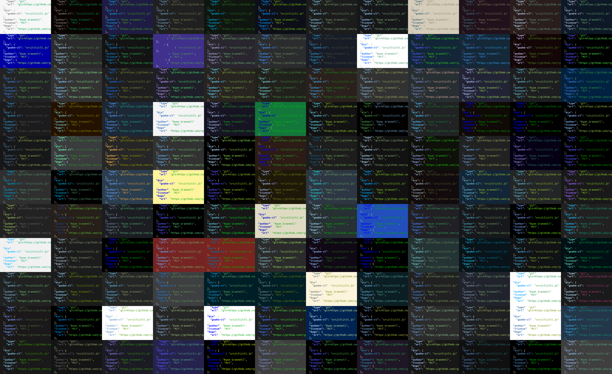

# guake-cl

Guake-cl is a command-line tool that lets you easily change your guake colour scheme.

 </img>

This tool:

- has 169 colour schemes to choose from
- allows you to choose light, dark modes
- allows random-selection

 </img>

### Usage

Use:

```
guake-cl --help
guake-cl list-themes
```

To list all available colour schemes. Each scheme is bound to an option, so for example to enable
the `toy-chest` theme you would use the command.

```
guake-cl --toy-chest
```

For full documentation, read

```
guake-cl --help
```

### Changelog

#### v0.5.0

- Complete re-implementation in Golang
- Now correctly configures recent versions of guake (by updating dconf settings)
- Added additional colour schemes
- Improved snapcraft integration; no workaround (like v0.4.0) should be needed

#### v0.4.0

- To support snap integration, now defaults to printing but not setting commands to change colour-scheme.

#### v0.3.0

- Added support for choosing random light / dark colour schemes.

#### v0.2.0

- Added a functioning version flag.
- Added `--random` flag to select a random colour-scheme.

### License

The MIT License

Copyright (c) 2016 Ryan Grannell

Permission is hereby granted, free of charge, to any person obtaining a copy of this software and associated documentation files (the "Software"), to deal in the Software without restriction, including without limitation the rights to use, copy, modify, merge, publish, distribute, sublicense, and/or sell copies of the Software, and to permit persons to whom the Software is furnished to do so, subject to the following conditions:

The above copyright notice and this permission notice shall be included in all copies or substantial portions of the Software.

THE SOFTWARE IS PROVIDED "AS IS", WITHOUT WARRANTY OF ANY KIND, EXPRESS OR IMPLIED, INCLUDING BUT NOT LIMITED TO THE WARRANTIES OF MERCHANTABILITY, FITNESS FOR A PARTICULAR PURPOSE AND NONINFRINGEMENT. IN NO EVENT SHALL THE AUTHORS OR COPYRIGHT HOLDERS BE LIABLE FOR ANY CLAIM, DAMAGES OR OTHER LIABILITY, WHETHER IN AN ACTION OF CONTRACT, TORT OR OTHERWISE, ARISING FROM, OUT OF OR IN CONNECTION WITH THE SOFTWARE OR THE USE OR OTHER DEALINGS IN THE SOFTWARE.

### Versioning

Versioning complies with the Semantic Versioning 2.0.0 standard.

http://semver.org/
